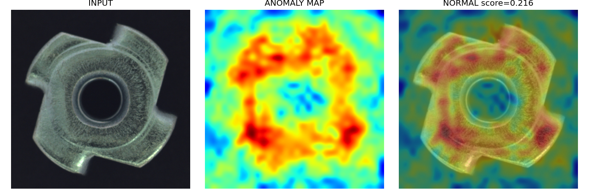
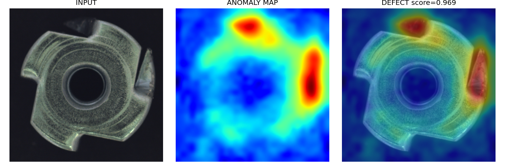
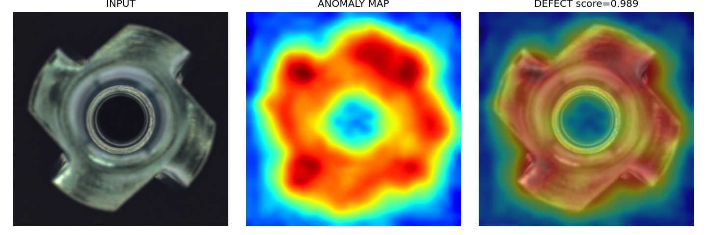
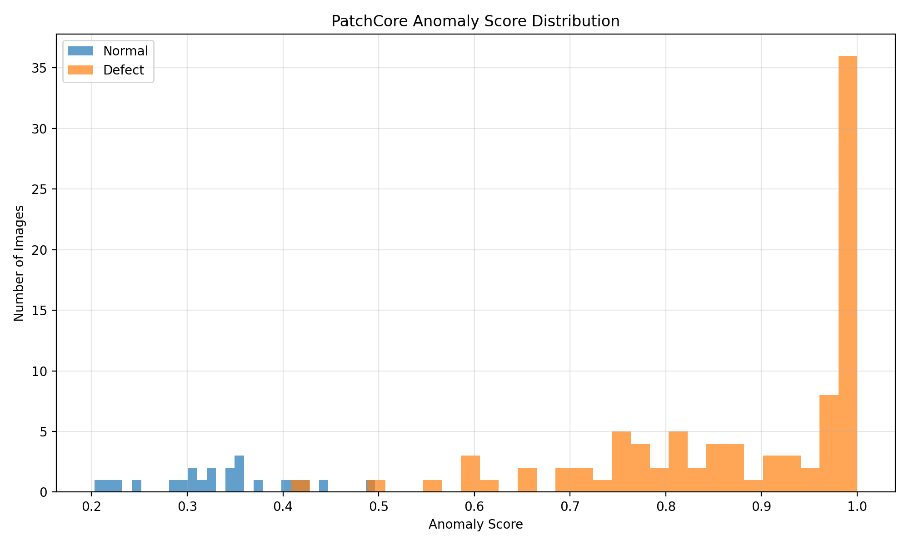
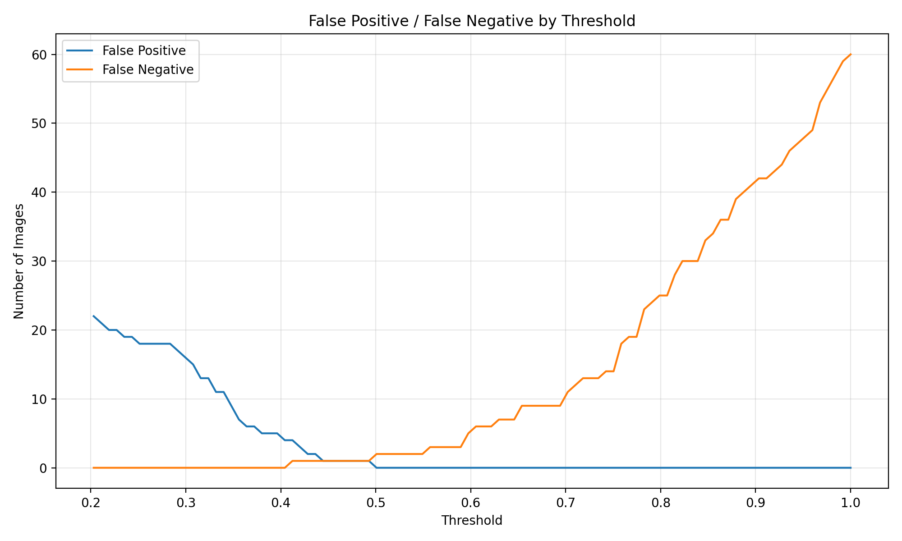

# PatchCore 기반 산업 이상탐지

MVTec AD `metal_nut` 데이터를 활용한 **Normal-only PatchCore 기반 산업 이상탐지 프로젝트**입니다.

정상 이미지로부터 PatchCore Memory Bank를 구축하고, 테스트 이미지의 Patch Feature와 정상 Feature 간 거리를 기반으로 이상 점수를 산출했습니다. 또한 Image/Pixel 단위 평가, Anomaly Score 분포, Threshold 분석, Anomaly Map 시각화를 통해 모델의 성능과 한계를 분석했습니다.

---

## 1. Project Overview

### 프로젝트 목적

산업 현장에서 정상 제품과 불량 제품을 구분하기 위해서는 불량 데이터가 충분하지 않은 상황에서도 이상을 탐지할 수 있는 방법이 필요합니다.

본 프로젝트에서는 **정상 데이터만을 학습에 사용하는 PatchCore**를 적용하여 다음 과정을 구현했습니다.

```text
MVTec AD
   ↓
정상 이미지 학습
   ↓
Patch Feature 추출
   ↓
Memory Bank 구축
   ↓
Coreset Sampling
   ↓
테스트 이미지 Feature와 정상 Feature 거리 계산
   ↓
Anomaly Score
   ↓
정상 / 이상 판정
   ↓
Anomaly Map으로 이상 영역 시각화
```

### 주요 구현

- MVTec AD `metal_nut` 데이터 기반 이상탐지
- Normal-only 학습
- PatchCore Memory Bank 구축
- Coreset Sampling
- Euclidean(L2) Distance 기반 이상 점수
- Image-level / Pixel-level 평가
- Anomaly Score 분포 분석
- Threshold 기반 FP / FN 분석
- Anomaly Map 시각화
- 학습된 Checkpoint를 이용한 별도 추론

---

## 2. Results

### 대표 추론 결과

GitHub 저장소에서 프로젝트의 핵심 결과를 바로 확인할 수 있도록 대표적인 `metal_nut` 추론 결과를 상단에 배치했습니다.

<table>
<tr>
<td align="center"><b>Normal</b><br>018.png · Score 0.2159</td>
<td align="center"><b>Defect</b><br>000.png · Score 0.9685</td>
<td align="center"><b>Localization</b><br>003.png · Score 0.9885</td>
</tr>
<tr>
<td></td>
<td></td>
<td></td>
</tr>
</table>

- **018.png**: 낮은 Anomaly Score를 보인 정상 추론 사례
- **000.png**: 높은 Anomaly Score를 보인 이상 추론 사례
- **003.png**: 이상은 탐지했지만 Anomaly Map의 activation 범위가 비교적 넓게 나타난 사례

### 정량 평가

| Metric | Score |
|---|---:|
| Image AUROC | **0.9980** |
| Image F1 Score | **0.9891** |
| Pixel AUROC | **0.9868** |
| Pixel F1 Score | **0.8386** |

---

## 3. Dataset

### MVTec AD

산업용 제품의 정상 및 이상 이미지를 포함하는 산업 이상탐지 데이터셋을 사용했습니다.

본 프로젝트에서는 `metal_nut` 카테고리를 최종 분석 대상으로 선정했습니다.

```text
metal_nut/
├─ train/
│  └─ good/
├─ test/
│  ├─ good/
│  ├─ bent/
│  ├─ color/
│  ├─ flip/
│  └─ scratch/
└─ ground_truth/
```

### 학습 방식

PatchCore는 불량 이미지를 직접 학습하는 방식이 아니라 **정상 이미지의 특징을 기반으로 정상 패턴을 Memory Bank로 구성**합니다.

따라서 학습에는 다음 데이터만 사용했습니다.

```text
Train
└─ good
   └─ 정상 이미지
```

테스트 단계에서는 정상 및 이상 이미지를 모두 사용하여 성능을 평가했습니다.

---

## 4. PatchCore Pipeline

PatchCore의 전체적인 처리 과정은 다음과 같습니다.

```text
정상 이미지
    ↓
Backbone Feature Extraction
    ↓
Layer 2 / Layer 3 Feature
    ↓
Patch Feature 구성
    ↓
Coreset Sampling
    ↓
Memory Bank
```

테스트 이미지가 입력되면:

```text
Test Image
    ↓
Patch Feature Extraction
    ↓
Memory Bank의 정상 Feature와 거리 계산
    ↓
Nearest Neighbor Search
    ↓
Anomaly Score
    ↓
Normal / Anomaly
```

---

## 5. Model Configuration

본 프로젝트에서는 Anomalib의 PatchCore 구현을 사용했습니다.

### Backbone

```text
Wide ResNet-50-2
```

### Feature Layer

```text
layer2
layer3
```

### 주요 설정

```python
Patchcore(
    backbone="wide_resnet50_2",
    layers=["layer2", "layer3"],
    coreset_sampling_ratio=0.1,
    num_neighbors=9
)
```

| 항목 | 설정 |
|---|---|
| Model | PatchCore |
| Backbone | Wide ResNet-50-2 |
| Feature Layer | layer2, layer3 |
| Coreset Sampling Ratio | 0.1 |
| Nearest Neighbors | 9 |
| Training | Normal-only |
| Category | metal_nut |
| Input Size | 256 × 256 |

---

## 6. Memory Bank

PatchCore에서는 정상 이미지에서 추출한 Patch Feature를 기반으로 **Memory Bank**를 구성합니다.

모든 Feature를 그대로 사용하는 대신 Coreset Sampling을 적용하여 Memory Bank의 크기를 줄입니다.

```text
Normal Images
     ↓
Patch Features
     ↓
Coreset Sampling
     ↓
Memory Bank
```

본 프로젝트에서는 다음 설정을 사용했습니다.

```text
coreset_sampling_ratio = 0.1
```

이를 통해 정상 Feature의 대표적인 부분을 Memory Bank에 저장하여 추론 시 비교 대상으로 사용했습니다.

---

## 7. Anomaly Score

테스트 이미지의 Patch Feature를 정상 Memory Bank의 Feature와 비교합니다.

각 Feature 간 거리는 **Euclidean Distance(L2 Distance)**를 사용합니다.

### Euclidean Distance

두 Feature 벡터 `x`, `m` 사이의 거리는 다음과 같이 계산할 수 있습니다.

\[
d(x,m)=\sqrt{\sum_{j=1}^{n}(x_j-m_j)^2}
\]

테스트 Patch `x`에 대해 Memory Bank에서 가장 가까운 정상 Feature를 찾으면:

\[
d_{min}(x)=\min_i d(x,m_i)
\]

거리의 의미는 다음과 같습니다.

```text
거리 작음
→ 정상 Memory와 유사
→ 정상에 가까움

거리 큼
→ 정상 Memory와 차이가 큼
→ 이상 가능성이 높음
```

Patch별 거리 정보를 이용하여 이미지 단위 이상 점수와 이상 영역을 분석합니다.

---

## 8. Evaluation

MVTec AD `metal_nut` 테스트 데이터 전체를 대상으로 평가했습니다.

### Test Dataset

```text
전체 이미지 : 115장
정상        : 22장
불량        : 93장
```

### Result

| Metric | Score |
|---|---:|
| Image AUROC | **0.9980** |
| Image F1 Score | **0.9891** |
| Pixel AUROC | **0.9868** |
| Pixel F1 Score | **0.8386** |

### 결과 해석

Image-level 지표에서는 높은 성능을 확인했습니다.

특히 Image AUROC가 `0.9980`으로 나타나 정상 이미지와 이상 이미지를 구분하는 능력이 높게 나타났습니다.

Pixel-level에서는 AUROC가 `0.9868`로 높은 수준을 보였지만, Pixel F1 Score는 `0.8386`으로 상대적으로 낮았습니다.

이는 이상 여부 자체를 구분하는 것과 비교하여 **이상 영역을 정확한 픽셀 단위로 좁혀내는 문제에서 추가적인 한계가 존재함**을 보여줍니다.

---

## 9. Anomaly Score Distribution

테스트 이미지의 Anomaly Score를 정상과 불량으로 구분하여 분석했습니다.

### Normal

```text
Min    : 0.2030
Mean   : 0.3352
Median : 0.3370
Max    : 0.4962
```

### Defect

```text
Min    : 0.4087
Mean   : 0.8811
Median : 0.9380
Max    : 1.0000
```



정상 이미지의 Score는 대체로 `0.2 ~ 0.4` 구간에 분포하고, 불량 이미지의 Score는 대체로 `0.6 ~ 1.0` 구간에 분포했습니다.

다만 일부 구간에서는 정상과 불량 Score가 겹치는 현상도 확인했습니다.

이를 통해 단순히 Score의 절대값만 보는 것이 아니라 **Threshold와 함께 정상/이상 판정을 해석해야 한다는 점**을 확인했습니다.

---

## 10. Threshold Analysis

테스트 데이터의 실제 라벨을 이용하여 Score 구간별 FP / FN 변화를 분석했습니다.

분석 과정에서 약 `0.45` 부근의 Threshold에서 다음 결과를 확인했습니다.

```text
TP = 92
TN = 21
FP = 1
FN = 1
```

전체 115장 중:

```text
113 / 115 = 98.26%
```

의 판정이 일치했습니다.

> **주의:** 해당 Threshold는 테스트 데이터의 실제 라벨을 이용해 분석한 값입니다. 따라서 실제 생산 환경에서 사용할 최종 운영 Threshold 또는 일반화된 최적 Threshold로 해석하지 않았습니다.



테스트 데이터에서 Threshold 변화에 따른 FP / FN 변화를 확인했습니다.

실제 적용에서는 생산 환경의 정상 데이터 분포, 불량 검출 우선순위, 허용 가능한 FP/FN 수준 등을 고려하여 별도의 Threshold 검증이 필요합니다.

---

## 11. Anomaly Map

PatchCore는 이미지 전체의 이상 여부뿐 아니라 **어느 영역에서 정상 Feature와 차이가 발생했는지**를 Anomaly Map 형태로 확인할 수 있습니다.

### Normal

정상 이미지에서도 일부 영역에 Anomaly Map activation이 나타날 수 있었습니다.

이는 모든 정상 Patch가 Memory Bank의 Feature와 완전히 동일하지 않기 때문입니다.

따라서:

```text
Anomaly Map의 일부 activation
≠
무조건 불량
```

으로 해석해야 합니다.

최종 이미지 단위 판정에서는 Anomaly Score와 Threshold를 함께 사용합니다.

### Defect

`bent`, `color`, `flip`, `scratch` 등의 이상 이미지에서는 이상 영역 주변에서 높은 activation이 나타나는 것을 확인했습니다.

특히 구조적인 변화가 있는 이상은 비교적 명확하게 영역이 나타났습니다.

상단 `Results`의 대표 추론 결과를 통해 정상/이상 이미지와 Anomaly Map의 차이를 확인할 수 있습니다.

---

## 12. Localization Error Analysis

Pixel F1 Score가 Image-level 성능보다 낮게 나타난 원인을 확인하기 위해 Anomaly Map을 시각적으로 분석했습니다.

대표적으로 `scratch`와 같은 얇은 이상에서는 실제 이상 영역보다 Anomaly Map이 넓게 활성화되는 현상이 나타났습니다.

가능한 원인은 다음과 같습니다.

```text
얇은 이상 영역
      ↓
Patch Feature 기반 표현
      ↓
주변 Patch까지 유사한 이상 특성 반영
      ↓
Anomaly Map 영역 확장
```

따라서 본 프로젝트에서는:

- 이상 이미지인지 판별하는 성능
- 이상 위치를 픽셀 단위로 정확하게 좁히는 성능

이 서로 다를 수 있음을 확인했습니다.

상단 `Results`의 `003.png` 사례는 이상을 탐지했지만 Anomaly Map의 activation 범위가 비교적 넓게 나타난 사례입니다.

---

## 13. Inference

학습된 PatchCore Checkpoint를 저장한 후 별도의 추론 스크립트를 통해 이미지를 입력했습니다.

```text
Trained Checkpoint
        ↓
Input Image
        ↓
PatchCore Inference
        ↓
Anomaly Score
        ↓
Normal / Defect
        ↓
Anomaly Map
        ↓
Result Image Save
```

### Representative Inference

별도 추론에서는 MVTec AD 테스트 이미지 중 일부를 무작위로 선정하여 모델에 입력했습니다.

> 프로젝트 폴더의 `metal_nut_real`이라는 이름은 추론용 이미지 폴더를 구분하기 위한 폴더명이며, 해당 이미지는 실제 산업 현장에서 직접 촬영한 Real Data가 아니라 **MVTec AD Test Set에서 무작위로 선정한 대표 샘플**입니다.

| Image | Anomaly Score | Prediction |
|---|---:|---|
| 018.png | 0.2159 | 정상 |
| 019.png | 0.2299 | 정상 |
| 000.png | 0.9685 | 불량 |
| 002.png | 0.8452 | 불량 |
| 003.png | 0.9885 | 불량 |
| 008.png | 0.8760 | 불량 |
| 010.png | 0.9556 | 불량 |
| 011.png | 1.0000 | 불량 |
| 016.png | 0.7957 | 불량 |
| 021.png | 0.7060 | 불량 |

총 10장 중 정상 2장, 불량 8장이었습니다.

---

## 14. GUI Inference Issue

추론 과정에서 결과 이미지 저장과 예측은 정상적으로 수행되었으나, 마지막 `cv2.imshow()` 단계에서 OpenCV GUI 관련 오류가 발생했습니다.

```text
cv2.error:
The function is not implemented
...
in function 'cvShowImage'
```

이는 현재 OpenCV 환경에서 GUI 표시 기능이 지원되지 않아 발생한 문제이며, **모델 추론 또는 이상탐지 결과 생성의 오류가 아닙니다.**

실제 결과 이미지는 `cv2.imwrite()`를 통해 정상적으로 저장되었습니다.

```text
Inference
→ Prediction 정상
→ Anomaly Map 생성 정상
→ 결과 이미지 저장 정상
→ GUI display는 환경 제약으로 미지원
```

---

## 15. Limitations

### 1. Threshold 일반화

현재 Threshold 분석은 MVTec AD 테스트 데이터의 라벨을 이용한 분석입니다.

실제 생산 환경에서는 별도의 validation set 또는 현장 데이터를 이용하여 Threshold를 결정할 필요가 있습니다.

### 2. Pixel-level Localization

Image-level 이상탐지 성능에 비해 Pixel-level F1 Score가 낮았습니다.

특히 얇거나 미세한 이상에서는 Anomaly Map이 실제 이상 영역보다 넓게 나타날 수 있습니다.

### 3. Dataset Domain Gap

MVTec AD는 통제된 산업용 데이터셋이므로 실제 제조 현장의 조명, 카메라, 제품 편차, 배경 등의 변화와 차이가 있을 수 있습니다.

실제 적용을 위해서는 현장 데이터 기반의 추가 검증이 필요합니다.

### 4. Real-world Validation

본 프로젝트의 별도 추론 샘플은 MVTec AD Test Set에서 선정했습니다.

따라서 실제 생산 라인 데이터에 대한 성능을 검증한 프로젝트로 해석하지 않습니다.

---

## 16. Tech Stack

### AI / Computer Vision

- Python
- PyTorch
- Anomalib
- PatchCore
- OpenCV

### Dataset

- MVTec AD

### Model

- Wide ResNet-50-2
- PatchCore
- Memory Bank
- Coreset Sampling

### Evaluation

- Image AUROC
- Image F1 Score
- Pixel AUROC
- Pixel F1 Score
- Anomaly Score Distribution
- Threshold Analysis

---

## 17. Project Structure

```text
patchcore-anomaly-detection/
│
├─ README.md
│
├─ src/
│   ├─ patchcore_anomaly_detection.py
│   ├─ patchcore_metal_nut_real_inspect.py
│   └─ Score_Analysis.py
│
├─ results/
│   ├─ score_analysis/
│   │   ├─ 01_score_distribution.png
│   │   └─ 02_threshold_fp_fn.png
│   │
│   └─ inference/
│       ├─ 000_result.png
│       ├─ 002_result.png
│       ├─ 003_result.png
│       ├─ 008_result.png
│       ├─ 010_result.png
│       ├─ 011_result.png
│       ├─ 016_result.png
│       ├─ 018_result.png
│       ├─ 019_result.png
│       └─ 021_result.png
│
└─ portfolio/
    └─ 양진희_PatchCore_이상탐지_포트폴리오.pptx
```

> `model.ckpt`와 같은 대용량 Checkpoint와 MVTec AD 원본 데이터셋은 GitHub에 업로드하지 않습니다.

---

## 18. Key Takeaways

### Normal-only Learning

불량 데이터를 직접 학습하지 않고 정상 데이터만으로 정상 Feature 분포를 구성하여 이상을 탐지했습니다.

### Feature-based Anomaly Detection

이미지 전체를 단순 분류하는 것이 아니라 Patch Feature와 정상 Memory Bank의 거리를 이용하여 이상도를 계산했습니다.

### Quantitative Evaluation

Image / Pixel 단위 AUROC와 F1 Score를 모두 측정하여 이상탐지 성능을 정량적으로 평가했습니다.

### Error Analysis

Anomaly Score 분포와 Threshold 분석, Anomaly Map 시각화를 통해 모델의 오류 및 한계를 확인했습니다.

### Industrial Application Perspective

단순히 모델 성능 수치만 제시하는 것이 아니라,

```text
정상 데이터 학습
→ 이상 점수
→ 판정 기준
→ 이상 영역 시각화
→ FP / FN 분석
→ 현장 적용 시 한계
```

까지 연결하여 산업 이상탐지 시스템의 전체 흐름을 구현했습니다.

---

## 19. Future Work

향후 다음과 같은 방향으로 확장할 수 있습니다.

- 실제 제조 현장 이미지 기반 검증
- Validation Dataset 기반 Threshold 선정
- 다양한 산업 제품 카테고리 비교
- 다른 Anomaly Detection 모델과 성능 비교
- Inference API 구축
- 실시간/준실시간 품질 진단 서비스 연계
- 관리자용 이상탐지 Dashboard 구축

---

## 20. References

- MVTec AD Dataset
- Anomalib
- PatchCore: Towards Total Recall in Industrial Anomaly Detection
